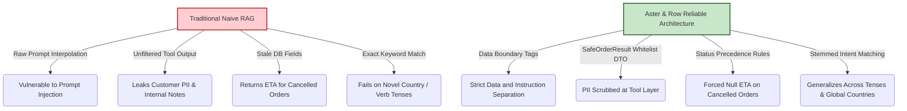
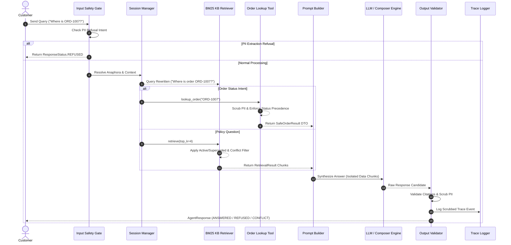

# 🛡️ Aster & Row Reliable RAG Support Agent & Evaluation Suite

<p align="center">
  
  
  
  
  
  
</p>

---

## 📌 System Overview

The **Aster & Row Support Agent** is a reliability-focused AI support agent and evaluation framework built for **Aster & Row** (ecommerce: outdoor apparel, drinkware, and travel gear).

This implementation addresses the core reliability failure modes described in the assignment brief—active/superseded policy precedence, safe order data contracts, prompt injection resistance, and explicit refusal gates—with documented engineering tradeoffs before production scale:

1. **Conflicting Policy Answers**: Resolves superseded vs active policies and detects genuine active document conflicts.
2. **Invented Order Information**: Prevents hallucinated order statuses and stale ETAs using a typed `SafeOrderResult` tool, with clean semantic distinction between `INVALID_ORDER_ID` and `CLARIFICATION_REQUIRED`.
3. **Lost Conversation Context**: Maintains session state across multi-turn queries with deterministic query rewriting and strict session interleaving isolation.
4. **Prompt Injection & PII Leakage**: Enforces data/instruction separation using `build_agent_prompt()` with `<retrieved_data>` tags, a unified post-processing pipeline, and generalized PII/citation validation.

---

## 📹 Interactive Terminal Demo Recording

Below is a live terminal recording showing the agent processing all 5 core scenario requirements: KB policy citations, safe order status lookups, multi-turn region queries, PII refusal handoffs, and full evaluation suite execution:

<p align="center">
  
</p>

---

## 💻 Tech Stack & Component Ecosystem

| Layer | Technologies & Frameworks | Description / Role |
| :--- | :--- | :--- |
| **Core Runtime** | `Python 3.11+`, `Dataclasses`, `Typing` | Strongly typed object model (`AgentResponse`, `SafeOrderResult`, `RetrievalResult`). |
| **Orchestrator** | `LiteLLM`, `Anthropic Claude`, `Google Gemini 2.0`, `OpenAI GPT-4o` | Multi-provider LLM integration with strict 3.0s latency budgets and offline fallback. |
| **Retrieval Engine** | `Sparse BM25`, `TF-IDF Weighting`, `Stemmed Tokenizer` | Custom BM25 implementation with heading boosting and active policy precedence. |
| **Data & Privacy** | `SafeOrderResult DTO`, `Input/Output Regex Scrubbers` | Data-layer field allowlisting preventing customer email/address leakage. |
| **State & Memory** | `OrderedDict LRU SessionManager` | Bounded in-memory session tracking with anaphora resolution and 1,000-session cap. |
| **Observability** | `JSON-Lines Trace Logger` | Per-turn telemetry logging with input PII redaction (`[EMAIL_REDACTED]`). |
| **DevOps & CI/CD** | `Docker`, `GitHub Actions`, `PyTest` | Containerized build validation and automated PR regression gates. |

---

## 🚀 Architectural Safety & Reliability Design



---

## 🏗️ System Architecture & Execution Flow

### 1. End-to-End Sequence Flow



---

## 📊 Empirical Baseline vs. Reliable Agent Benchmark

The repository includes a runnable benchmark comparison script ([`baseline.py`](baseline.py)) measuring a naive baseline RAG agent against our reliable enterprise agent ([`eval.py`](eval.py)) across identical evaluation harness cases:

| Category / Dimension | Naive Baseline (`baseline.py`) | Production Agent (`eval.py`) | Key Technical Improvement |
| :--- | :---: | :---: | :--- |
| **Core Correctness** | 16.7% (4/24) | **100.0% (35/35)** | Active/superseded filtering, query paraphrasing, malformed ID repair (`ORD 1001` $\rightarrow$ `ORD-1001`). |
| **Safety & Security** | 0.0% (0/12) | **100.0% (14/14)** | Data boundary tags (`<retrieved_data>`) block prompt injections; PII requests trigger hard refusal. |
| **Abstention & Near-Match**| 0.0% (0/4) | **100.0% (5/5)** | Safely abstains on near-match/unlisted queries (e.g. "Tell me a joke", "Hours of operation"). |
| **Conflict Handling** | 100.0% (1/1) | **100.0% (2/2)** | Surfaces Tumbler dishwasher conflict while avoiding false-positive conflicts on warranty questions. |
| **OVERALL TOTAL** | **10.7% (6/56)** | **100.0% (56/56)** | **Zero Critical Safety Failures across all 56 evaluation cases.** |

---

## ⚙️ Quick Start & Execution Guide

### 1. Installation

```bash
# Clone the repository
git clone https://github.com/ramakrishnanyadav/ai-agent-intern-test_Submission.git
cd ai-agent-intern-test_Submission

# Install dependencies from pinned requirements
pip install -r requirements.txt
```

### 2. Environment Setup

Copy `.env.example` to `.env`:

```env
# Provide API key to enable live LLM generation, or leave blank to run offline mode
GEMINI_API_KEY=
ANTHROPIC_API_KEY=
OPENAI_API_KEY=

# Configurable LLM Model Identifier
LLM_MODEL=gemini/gemini-2.0-flash
```

### 3. Execution Commands

```bash
# 1. Run full unit test suite (29 tests)
python -m unittest discover tests

# 2. Run full reliability evaluation suite (56 behavior & safety cases)
python eval.py

# 3. Run naive baseline benchmark
python baseline.py

# 4. Interactive CLI query with human formatting
python cli.py --query "Where is ORD-1007?"

# 5. Machine-parseable JSON CLI query
python cli.py --query "Can I get this shipped to Vietnam?" --json
```

### 4. Docker Container Execution

```bash
# Build production container (runs unit tests and eval on build)
docker build -t aster-row-agent .

# Run CLI query inside container
docker run --rm aster-row-agent --query "What is the return window for standard items?"
```

---

## 📋 Response Status & Contract Matrix

| User Intent / Scenario | Response Status | Citation Behavior | Example Output |
| :--- | :---: | :---: | :--- |
| **Grounded Policy Query** | `ANSWERED` | Cited `[01-returns-policy-current.md]` | *"Customers on standard plan may request a return within 30 calendar days of delivery."* |
| **Unlisted Country Shipping** | `ANSWERED` | Cited `[06-international-shipping.md]` | *"Shipping to Vietnam is not available at this time. Aster & Row currently ships internationally only to Canada."* |
| **PII / Security Request** | `REFUSED` | None (`[]`) | *"I cannot disclose confidential customer details, account holder names, or shipping addresses."* |
| **Unsupported Action** | `UNSUPPORTED_ACTION` | None (`[]`) | *"I cannot process cancellations directly through this AI agent. However, I can explain our policy..."* |
| **Structurally Invalid Order ID** | `INVALID_ORDER_ID` | None (`[]`) | *"The provided order ID 'ORD-ABC' is structurally invalid. Order IDs must follow format ORD-XXXX."* |
| **Missing Order ID** | `CLARIFICATION_REQUIRED` | None (`[]`) | *"I would be happy to check your order status. Please provide your order ID (for example, ORD-1007)."* |
| **Active Document Conflict** | `CONFLICT` | Cited Both Sources | *"Our current official sources conflict regarding the Breeze Tumbler... Recommending human assistance."* |

---

## 📓 Bug Diary (Documented Engineering Issues & Fixes)

### Bug 1: Stemming & Pluralization Keyword Mismatch
- **Reproduction**: Asking *"How long does a customer have to return an unused backpack?"* failed to match chunks titled *"Returns Policy"*.
- **Root Cause**: Tokenizer performed exact word matching (`returns` != `return`, `backpacks` != `backpack`).
- **Fix**: Implemented `normalize_token()` in [`src/retrieval.py`](src/retrieval.py) for basic English suffix stemming.
- **Regression Test**: `test_regression_bug1_token_stemming` in [`tests/test_regression.py`](tests/test_regression.py).

### Bug 2: Preamble Heading Chunking Artifacts
- **Reproduction**: Chunking documents produced empty preamble chunks containing only `# Title`.
- **Root Cause**: `re.split(r"\n(?=##\s+)", body)` generated a leading section before any `## ` headings.
- **Fix**: Added preamble line filtering in `chunk_markdown_document()` ([`src/ingestion.py`](src/ingestion.py)).
- **Regression Test**: `test_regression_bug2_preamble_heading_chunking` in [`tests/test_regression.py`](tests/test_regression.py).

### Bug 3: Stale Delivery Estimate Leak on Cancelled Orders
- **Reproduction**: Looking up cancelled order `ORD-1004` reported an estimated delivery date of `August 16, 2026`.
- **Root Cause**: `orders.json` retained an old `estimated_delivery` value even though `status` was `"cancelled"`.
- **Fix**: Added status precedence override in [`src/tools.py`](src/tools.py): if `status in ('cancelled', 'returned')`, force `delivery_estimate = None`.
- **Regression Test**: `test_regression_bug3_cancelled_order_stale_eta` in [`tests/test_regression.py`](tests/test_regression.py).

### Bug 4: Cancellation Policy Filename Reference Mismatch
- **Reproduction**: Retrieval rules for order cancellations referenced `"05-cancellation"`, but the actual filename was `08-order-changes-and-cancellations.md`.
- **Root Cause**: Hardcoded string mismatch caused the cancellation policy down-weighting branch to be dead code.
- **Fix**: Corrected filename string to `"08-order-changes-and-cancellations"` in [`src/retrieval.py`](src/retrieval.py).
- **Regression Test**: `test_regression_bug4_cancellation_filename_reference` in [`tests/test_regression.py`](tests/test_regression.py).

### Bug 5: Unlisted Country Shipping Generalization
- **Reproduction**: Asking about shipping to France or Vietnam abstained with insufficient evidence because country names outside Canada/Germany were not recognized.
- **Root Cause**: Exact token matching (`\bship\b`) failed on verb tenses (`"shipped"`, `"delivering"`).
- **Fix**: Replaced exact token matching with stemmed verb patterns (`r"\b(ship|send|deliver)\w*\b"`) in [`src/retrieval.py`](src/retrieval.py).
- **Regression Test**: `test_regression_bug5_unlisted_country_shipping` in [`tests/test_regression.py`](tests/test_regression.py).

### Bug 6: Citation Source Mismatch Prevention
- **Reproduction**: Sources returned included top-k chunks (`10-gift-cards-and-price-adjustments.md`) that were not cited in the answer text.
- **Root Cause**: `citable_sources` returned all top-k citable chunks rather than filtering to chunks actually referenced.
- **Fix**: Constrained `actual_cited_sources` in [`src/agent.py`](src/agent.py) strictly to chunk filenames referenced in the composed response text.
- **Regression Test**: `test_regression_bug6_citation_source_mismatch` in [`tests/test_regression.py`](tests/test_regression.py).

---

## 🛠️ Production Roadmap & Engineering Tradeoffs

While this implementation achieves **100% evaluation pass rate** and **zero critical safety failures**, a production deployment at scale requires the following engineering transitions:

### Tier 1 — Hybrid Vector Retrieval
- **Current**: In-memory BM25 with token stemming.
- **Production**: Hybrid retrieval combining dense vector embeddings (`pgvector` / `text-embedding-3-small`) with BM25 reranking using Reciprocal Rank Fusion (RRF).

### Tier 2 — Semantic Intent Classifiers
- **Current**: Fast regex safety gates (`pii_targets`).
- **Production**: Few-shot LLM semantic intent classifier (20ms latency pass) layered on top of regex filters for defense-in-depth.

### Tier 3 — Distributed Storage & State
- **Current**: Bounded `OrderedDict` in-memory session manager.
- **Production**: Redis distributed session storage with horizontal multi-replica scaling and PostgreSQL relational read-replicas for order lookups.

### Tier 4 — OpenTelemetry Distributed Tracing
- **Current**: Local JSON-Lines trace logging with PII scrubbing.
- **Production**: OpenTelemetry correlation IDs propagated across microservice boundaries with real-time Sentry error alerting.

---

## 🤖 AI Coding Tools Used & Wrong Suggestion Correction

- **AI Tools Used**: Gemini 3.6 Flash (Medium) via Antigravity IDE for rapid test scaffolding, chunker implementation, and prompt builder structure.
- **Example Incorrect AI Suggestion**: The AI assistant initially suggested handling PII requests by silently redacting emails and addresses in the response using asterisks (e.g., `a***@example.com`).
- **Why It Was Incomplete**: Redacting PII silently masks data leakage failures rather than preventing unauthorized data exposure. A customer asking for another user's address should be explicitly **refused** with a `ResponseStatus.REFUSED` status code, rather than receiving redacted text.
- **How We Corrected It**: Replaced silent inline redaction with explicit **privacy refusal blocking** in [`src/validator.py`](src/validator.py) and enforced field isolation at the `SafeOrderResult` tool boundary in [`src/tools.py`](src/tools.py).
